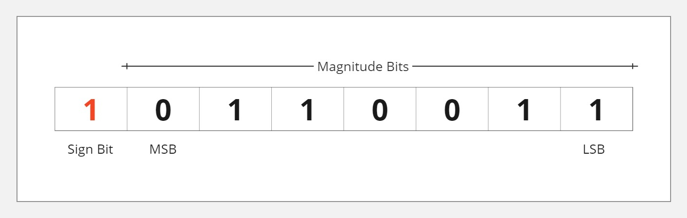

# Binary numbers

For humans, the decimal system is the most intuitive, as it is what we use in our daily lives. And it is represented by 10 symbols from 0 to 9.
For computers, the binary system is the most efficient, and it is represented by 2 symbols, 0 and 1.
Another thing we must keep in mind is that computers group bits into bytes, which are sets of 8 bits. And each byte can represent a number from 0 to 255.

For example, the number `10` in binary is `00001010`, and the number `255` is `11111111`.


## How can we convert?

### From binary to decimal

For we can convert a binary number to decimal, we are going to use powers of 2 elevating to the position of the bit, starting from the right to the left starting from 0 for each bit activated.

Let's imagine the binary number `11111111`. In this case we have 8 bits, and each bit is activated.

```
Bits   ->  1     1     1     1     1     1     1     1
Power  ->  2^7   2^6   2^5   2^4   2^3   2^2   2^1   2^0
Result ->  128   64    32    16    8     4     2     1   =  255
```

Other example, the binary number `00001010`. In this case we have 8 bits, and only the 4th and 1st bits are activated.

```
Bits   ->  0     0     0     0     1     0     1     0
Power  ->  0     0     0     0     2^3   0     2^1   0
Result ->  0     0     0     0     8     0     2     0   =  10
```

How you can imagine, zero (`0`) in decimal is also zero (`00000000`) in binary because it has no bits activated.

```
Bits   ->  0     0     0     0     0     0     0     0
Power  ->  0     0     0     0     0     0     0     0
Result ->  0     0     0     0     0     0     0     0   =  0
```

### From decimal to binary

To convert a decimal number to binary, we will perform integer division on the number by 2 and retrieve the remainder. This process will be iterated until the result becomes zero. Consequently, we will obtain all the remainders in reverse order, which will constitute the binary representation.

For example, `201` in binary is `11001001`. Let's see how we can get this result.

```python
# 1º step
201 / 2 = 100.5 # Exact division
201 // 2 = 100 # Integer division
201 % 2 = (1) # Remainder

# 2º step, we are going to get the integer division of the previous result
100 / 2 = 50.0
100 // 2 = 50
100 % 2 = (0)

# 3º step
50 / 2 = 25.0
50 // 2 = 25
50 % 2 = (0)

# 4º step
25 / 2 = 12.5
25 // 2 = 12
25 % 2 = (1)

# 5º step
12 / 2 = 6.0
12 // 2 = 6
12 % 2 = (0)

# 6º step
6 / 2 = 3.0
6 // 2 = 3
6 % 2 = (0)

# 7º step
3 / 2 = 1.5
3 // 2 = 1
3 % 2 = (1)

# 8º step
1 / 2 = 0.5
1 // 2 = 0
1 % 2 = (1)

# Now we will get all the remainders in reverse order
# 11001001
```
> Note: The exact division is not necessary in this process, I just put it to show the difference between the exact division and the integer division.


Other example, `11` in binary is `1011`. Let's see how we can get this result.

```python
# 1º step
11 // 2 = 5
11 % 2 = (1)

# 2º step
5 // 2 = 2
5 % 2 = (1)

# 3º step
2 // 2 = 1
2 % 2 = (0)

# 4º step
1 // 2 = 0
1 % 2 = (1)

# In this example, we just have 4 remainders, so we will get the result in reverse order, and remaining bits will be zero (Left zeros as other any number)

# 1011
```


## Anatomy of a binary numbers

Ok, the previous examples were simple. To get the next concepts, we need to understand the anatomy of a binary numbers.



* The **Sign Bit** is the leftmost bit, and it represents the sign of the number. If the sign bit is `0`, the number is positive, and if the sign bit is `1` the number is negative.

* The **Magnitude Bits** are the remaining bits, and they represent the magnitude of the number.

* The **Most Significant Bit (MSB)** is the leftmost bit of the magnitude bits, and it represents the most significant bit of the number.

* The **Least Significant Bit (LSB)** is the rightmost bit of the magnitude bits, and it represents the least significant bit of the number.


In the following example, I will use a strongly-typed language, such as C# or Java, because these languages have clearer type sizes.

For instance, an `int` in C# is 32 bits (or 4 bytes),with a value range from `-2,147,483,648` to `2,147,483,647`. You might wonder: if an `int` is 32 bits, why isn't the range from `-4,294,967,295` to `4,294,967,295`? This is because 32 active bits can indeed represent the number `4,294,967,295`. The explanation lies in the allocation of these bits: one bit is reserved for sign, leaving the remaining 31 bits to define the magnitude of the number. Another question might arise: why is the negative range slightly larger than the positive one? This is because `0` is counted as a positive number. As such, the positive range starts at `0`, while the negative range begins at `-1`.

On the other hand, consider a uint (unsigned int) in C#. It also spans 32 bits (4 bytes), but its value range extends from 0 to 4,294,967,295. This is because, in this case, no bit is designated for the sign. As a result, all 32 bits are utilized to represent the magnitude of the number.


## Negative numbers

Now we already know about the anatomy of a binary numbers, how can we convert negative numbers?

To convert negative numbers, we have three possible methods:

### Sign and Magnitude:

The sign bit represents the sign of the number, and the remaining bits represent the magnitude of the number. The problem with this method is that we have two representations for zero, `00000000` and `10000000`.

For example `11` in binary is `00001011`, and `-11` in binary is `10001011`.

### One's Complement:

In this method, the process is simple. We just need to invert all the bits of the number. The problem with this method is the same as the problem with the previous method (Sign and Magnitude), we have two representations for zero, `00000000` and `11111111`.

For example `11` in binary is `00001011`, and `-11` in binary is `11110100`.


### Two's Complement:

The third method is the most used in computers. In this method, we invert all the bits of the number and add `1` to the result. The problem with this method is that we have one more negative number than positive number, but end of the day, that is not a real problem compared to the previous methods.

For example `11` in binary is `00001011`, and `-11` in binary is `11110101`.

Let me show an example in c#

```csharp
var positiveNumber = 11;
var negativeNumber = -11;

// Output: 00000000000000000000000000001011
Console.WriteLine(Convert.ToString(positiveNumber, 2).PadLeft(32, '0'));

// Output: 11111111111111111111111111110101
Console.WriteLine(Convert.ToString(negativeNumber, 2).PadLeft(32, '0'));
```


## Conclusion

In this article, we discussed fundamental concepts of binary numbers, including converting between binary and decimal, understanding bits, and representing negative numbers. These basics are vital for understanding computer operations. Many problems have efficient solutions, but we might not grasp them due to unfamiliarity with these basics. I'll explore more related topics in upcoming articles.